# dicekey Coffee Stamps データベース設計（逆生成）

## 分析概要

| 項目 | 値 |
|---|---|
| **分析日時** | 2026-05-19 |
| **ストレージ種別** | Soroban Ledger Storage (Instance + Persistent) |
| **コントラクト数** | 5 (+ 1 shared library) |
| **ストレージキー総数** | 24 種 |

---

## ストレージ概要

Soroban コントラクトは従来の RDBMS ではなく、Stellar Ledger 上のキー・バリューストレージを使用する。2 つのストレージ種別がある:

| 種別 | 用途 | TTL | 課金 |
|---|---|---|---|
| **Instance Storage** | コントラクト単位の設定データ (admin, flags, counters) | コントラクト存在期間 | コントラクトインスタンス料金に含む |
| **Persistent Storage** | ユーザー・資産単位のデータ (残高, NFT, クレーム) | 明示的延長必要 | エントリ単位 |

---

## ER 図（Soroban Storage モデル）

```mermaid
erDiagram
    ADMIN_CONFIG {
        Address admin "single admin per contract"
        bool initialized "initialization guard"
    }

    VISIT_STAMP {
        u64 id PK "auto-increment"
        Address owner FK "stamp holder"
        String venue "store location"
        u64 timestamp "ledger timestamp"
        TokenMeta meta "name, desc, image, extra"
    }

    STAMP_COUNTER {
        Address owner PK
        u64 count "total stamps"
    }

    VENUE_COUNTER {
        Address owner PK
        String venue PK
        u64 count "per-venue stamps"
    }

    BEANS_BALANCE {
        Address owner PK
        i128 balance "token balance"
    }

    BEANS_ALLOWANCE {
        Address from PK
        Address spender PK
        i128 amount "approved spending limit"
    }

    BEANS_SUPPLY {
        i128 total_supply "global minted total"
    }

    BENEFIT_NFT {
        u64 id PK "auto-increment"
        Address owner "current owner"
        String kind "e.g. free_drink_voucher"
        u64 expires_at "0 = no expiry"
        TokenMeta meta "name, desc, image, extra"
    }

    OWNER_TOKENS {
        Address owner PK
        Vec_u64 token_ids "owned benefit IDs"
    }

    BADGE {
        Address owner PK
        String kind PK "e.g. coffee_master"
        u64 id "auto-increment"
        u64 awarded_at "ledger timestamp"
        TokenMeta meta "name, desc, image, extra"
    }

    BADGE_KINDS {
        Address owner PK
        Vec_String kinds "owned badge types"
    }

    POLICY_CLAIM {
        Address user PK
        String policy_id PK "e.g. 10visit_bonus"
        bool claimed "always true when present"
    }

    STAMP_COUNTER ||--o{ VISIT_STAMP : "counts"
    VENUE_COUNTER ||--o{ VISIT_STAMP : "counts per venue"
    BEANS_BALANCE }o--o{ BEANS_ALLOWANCE : "approves"
    OWNER_TOKENS ||--o{ BENEFIT_NFT : "indexes"
    BADGE_KINDS ||--o{ BADGE : "indexes"
```



---

## Contract 1: dicekey-visit-stamps

### Storage Keys

```rust
enum StampKey {
    StampCount(Address),           // Persistent: user → u64
    Stamp(Address, u64),           // Persistent: (user, id) → VisitStamp
    VenueCount(Address, String),   // Persistent: (user, venue) → u64
    NextId,                        // Instance: u64 (auto-increment)
    Initialized,                   // Instance: bool
    BeansContract,                 // Instance: Address
    PolicyContract,                // Instance: Address
}
```

### データ構造

```rust
struct VisitStamp {
    id: u64,                // 一意の ID (0-indexed, auto-increment)
    owner: Address,         // 所有者の Stellar アドレス
    venue: VenueId,         // 店舗 ID (String: "shibuya", "shinjuku", "kyoto")
    timestamp: u64,         // 発行時の ledger timestamp
    meta: TokenMeta,        // メタデータ
}

struct TokenMeta {          // from shared
    name: String,           // e.g., "Visit #42"
    description: String,    // e.g., "dicekey Shibuya visit stamp"
    image_uri: String,      // メタデータ画像 URI
    extra_uri: String,      // 追加メタデータ URI (token_uri で返却)
}
```

### ストレージレイアウト

| キー | 種別 | 値型 | カーディナリティ | 説明 |
|---|---|---|---|---|
| `StampCount(addr)` | Persistent | u64 | 1 per user | ユーザー総スタンプ数 |
| `Stamp(addr, id)` | Persistent | VisitStamp | 1 per stamp | スタンプ実体 |
| `VenueCount(addr, venue)` | Persistent | u64 | 1 per (user, venue) | 店舗別スタンプ数 |
| `NextId` | Instance | u64 | 1 | グローバル ID カウンター |
| `Initialized` | Instance | bool | 1 | 初期化フラグ |
| `BeansContract` | Instance | Address | 0-1 | Beans コントラクト参照 |
| `PolicyContract` | Instance | Address | 0-1 | Policy コントラクト参照 |

### アクセスパターン

| 操作 | 読み取り | 書き込み |
|---|---|---|
| `issue()` | NextId, BeansContract, PolicyContract | Stamp, StampCount, VenueCount, NextId |
| `stamp_count()` | StampCount | — |
| `venue_count()` | VenueCount | — |
| `get_stamp()` | Stamp | — |
| `list_stamps()` | StampCount, Stamp (複数) | — |

---

## Contract 2: dicekey-beans-token

### Storage Keys

```rust
enum BeansKey {
    Balance(Address),              // Persistent: user → i128
    Allowance(Address, Address),   // Persistent: (from, spender) → i128
    TotalSupply,                   // Instance: i128
    Initialized,                   // Instance: bool
}
```

### ストレージレイアウト

| キー | 種別 | 値型 | カーディナリティ | 説明 |
|---|---|---|---|---|
| `Balance(addr)` | Persistent | i128 | 1 per user | Beans 残高 |
| `Allowance(from, spender)` | Persistent | i128 | 1 per pair | 委任送金枠 |
| `TotalSupply` | Instance | i128 | 1 | 総供給量 |
| `Initialized` | Instance | bool | 1 | 初期化フラグ |

### アクセスパターン

| 操作 | 読み取り | 書き込み |
|---|---|---|
| `mint()` | Balance, TotalSupply | Balance, TotalSupply |
| `transfer()` | Balance (from), Balance (to) | Balance (from), Balance (to) |
| `approve()` | — | Allowance |
| `transfer_from()` | Allowance, Balance (from) | Allowance, Balance (from), Balance (to) |
| `burn()` | Balance, TotalSupply | Balance, TotalSupply |
| `burn_from()` | Allowance, Balance, TotalSupply | Allowance, Balance, TotalSupply |

### 整合性制約

- `Balance(addr) >= 0` (常に)
- `Allowance(from, spender) >= 0` (常に)
- `TotalSupply = Σ Balance(addr)` (不変条件)
- `transfer` は TotalSupply を変更しない

---

## Contract 3: dicekey-benefits

### Storage Keys

```rust
enum BenefitKey {
    Token(u64),              // Persistent: id → BenefitNft
    OwnerTokens(Address),    // Persistent: owner → Vec<u64>
    OwnerCount(Address),     // Persistent: owner → u64
    NextId,                  // Instance: u64
    Initialized,             // Instance: bool
}
```

### データ構造

```rust
struct BenefitNft {
    id: u64,               // 一意の ID
    owner: Address,        // 現在の所有者 (譲渡で変更される)
    kind: String,          // 種別 (e.g., "free_drink_voucher")
    expires_at: u64,       // 有効期限 (ledger timestamp, 0 = 無期限)
    meta: TokenMeta,       // メタデータ
}
```

### ストレージレイアウト

| キー | 種別 | 値型 | カーディナリティ | 説明 |
|---|---|---|---|---|
| `Token(id)` | Persistent | BenefitNft | 1 per NFT | 特典券実体 |
| `OwnerTokens(addr)` | Persistent | Vec\<u64\> | 1 per user | 所有トークン ID リスト |
| `OwnerCount(addr)` | Persistent | u64 | 1 per user | 所有数 |
| `NextId` | Instance | u64 | 1 | グローバル ID カウンター |
| `Initialized` | Instance | bool | 1 | 初期化フラグ |

### 整合性制約

- `OwnerCount(addr) == len(OwnerTokens(addr))` (常に)
- `Token(id).owner == addr` iff `id ∈ OwnerTokens(addr)`
- burn 後は `Token(id)` が削除される

### 特記事項: 有効期限バリデーション

```rust
// transfer() と burn() の両方で実行
assert!(
    nft.expires_at == 0 || nft.expires_at > env.ledger().timestamp(),
    "benefit expired"
);
```

---

## Contract 4: dicekey-badges

### Storage Keys

```rust
enum BadgeKey {
    Badge(Address, String),  // Persistent: (user, kind) → Badge
    BadgeKinds(Address),     // Persistent: user → Vec<String>
    BadgeCount(Address),     // Persistent: user → u64
    NextId,                  // Instance: u64
    Initialized,             // Instance: bool
}
```

### データ構造

```rust
struct Badge {
    id: u64,               // 一意の ID
    owner: Address,        // 所有者
    kind: String,          // バッジ種別 (e.g., "coffee_master")
    awarded_at: u64,       // 授与時の ledger timestamp
    meta: TokenMeta,       // メタデータ
}
```

### ストレージレイアウト

| キー | 種別 | 値型 | カーディナリティ | 説明 |
|---|---|---|---|---|
| `Badge(addr, kind)` | Persistent | Badge | 1 per (user, kind) | バッジ実体 |
| `BadgeKinds(addr)` | Persistent | Vec\<String\> | 1 per user | 保有バッジ種別リスト |
| `BadgeCount(addr)` | Persistent | u64 | 1 per user | バッジ保有数 |
| `NextId` | Instance | u64 | 1 | グローバル ID カウンター |
| `Initialized` | Instance | bool | 1 | 初期化フラグ |

### 一意性制約

- `Badge(addr, kind)` はユニーク — 同一 (user, kind) ペアの重複発行は panic
- バッジは削除不可（永続）
- バッジは譲渡不可（Soulbound）

### バッジ種別一覧

| Kind | 条件 | 発行方式 |
|---|---|---|
| `coffee_master` | 100+ visits | 自動 (on_stamp_issued) |
| `morning_master` | 20+ morning visits | 手動 (check_morning_policy) |
| `spring_2026` | 5+ spring visits | 手動 (check_spring_policy) |

---

## Contract 5: dicekey-reward-policy

### Storage Keys

```rust
enum PolicyKey {
    VisitStampsContract,         // Instance: Address
    BenefitsContract,            // Instance: Address
    BadgesContract,              // Instance: Address
    Claimed(Address, String),    // Persistent: (user, policy_id) → bool
    Initialized,                 // Instance: bool
}
```

### ストレージレイアウト

| キー | 種別 | 値型 | カーディナリティ | 説明 |
|---|---|---|---|---|
| `VisitStampsContract` | Instance | Address | 1 | visit-stamps 参照 |
| `BenefitsContract` | Instance | Address | 1 | benefits 参照 |
| `BadgesContract` | Instance | Address | 1 | badges 参照 |
| `Claimed(addr, policy)` | Persistent | bool | 1 per (user, policy) | クレーム済みフラグ |
| `Initialized` | Instance | bool | 1 | 初期化フラグ |

### ポリシー定義（ハードコード）

| ポリシー ID | 閾値 | 報酬タイプ | 報酬内容 |
|---|---|---|---|
| `10visit_bonus` | stamp_count >= 10 | Benefit (NFT) | `free_drink_voucher` |
| `100visit_master` | stamp_count >= 100 | Badge (SBT) | `coffee_master` |
| `morning_lover` | morning_visits >= 20 | Badge (SBT) | `morning_master` |
| `spring_campaign` | spring_visits >= 5 | Badge (SBT) | `spring_2026` |

### クレーム追跡の整合性

- `Claimed(addr, policy_id)` は存在チェック (`has()`) で判定
- 一度クレーム済みになると永続（取り消し不可）
- リエントランシー対策: 報酬ミント前にクレーム済みマーク

---

## Off-chain ストレージ

### LocalStorage (ブラウザ)

| キー | 値 | アプリ |
|---|---|---|
| `dicekey_auth` | `{ publicKey: string, displayName: string }` | customer-app |
| `dicekey_staff_auth` | `{ venue: string, venueName: string }` | staff-app |

### 環境変数 (.env.testnet)

| キー | 値 | 用途 |
|---|---|---|
| `VITE_VISIT_STAMPS_CONTRACT` | Address | コントラクト参照 |
| `VITE_BEANS_TOKEN_CONTRACT` | Address | コントラクト参照 |
| `VITE_BENEFITS_CONTRACT` | Address | コントラクト参照 |
| `VITE_BADGES_CONTRACT` | Address | コントラクト参照 |
| `VITE_REWARD_POLICY_CONTRACT` | Address | コントラクト参照 |
| `VITE_ADMIN_ADDRESS` | Address | 管理者アドレス |
| `VITE_NETWORK` | `"testnet"` | ネットワーク識別 |
| `VITE_RPC_URL` | URL | Soroban RPC エンドポイント |

---

## ストレージサイズ見積もり

| エントリ | 推定サイズ | 成長パターン |
|---|---|---|
| VisitStamp | ~150 bytes | 1 per visit per user |
| StampCount | ~40 bytes | 1 per user |
| VenueCount | ~50 bytes | 1 per (user, venue) |
| Balance (Beans) | ~40 bytes | 1 per user |
| Allowance | ~56 bytes | 1 per (from, spender) pair |
| BenefitNft | ~160 bytes | 1 per benefit (deleted on burn) |
| OwnerTokens | ~8 * N bytes | grows with owned benefits |
| Badge | ~140 bytes | 1 per (user, kind), permanent |
| BadgeKinds | ~30 * N bytes | grows with earned badges |
| Claimed | ~50 bytes | 1 per (user, policy), permanent |

### スケーラビリティ考慮

- **スタンプ**: ユーザーあたり N 個のエントリ — `list_stamps()` のページネーション対応で大量データに対応
- **特典券**: burn で削除されるため、アクティブ数は限定的
- **バッジ**: 種別数が限定的 (現在 3 種) なため、スケーラビリティ問題なし
- **Beans**: ユーザーあたり 1 エントリのみ、効率的
