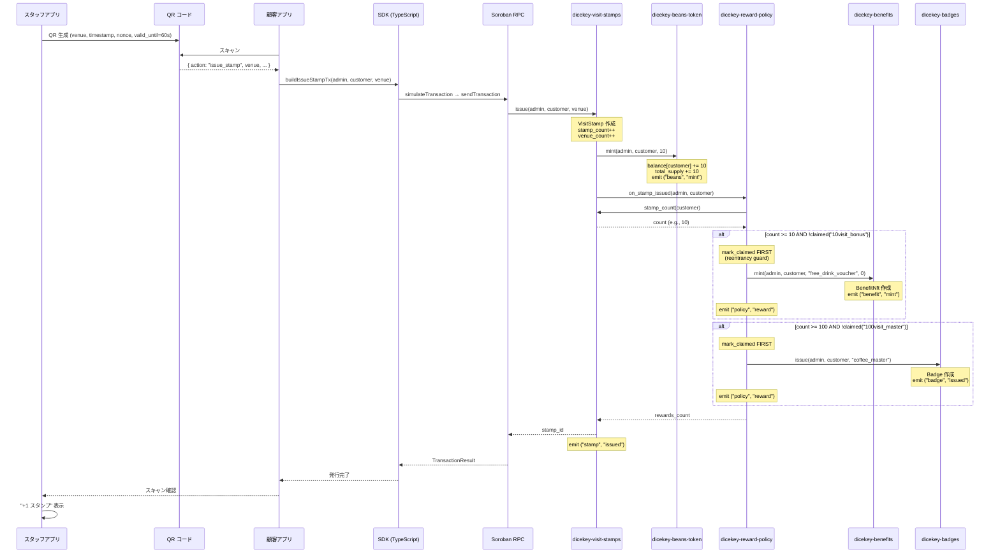
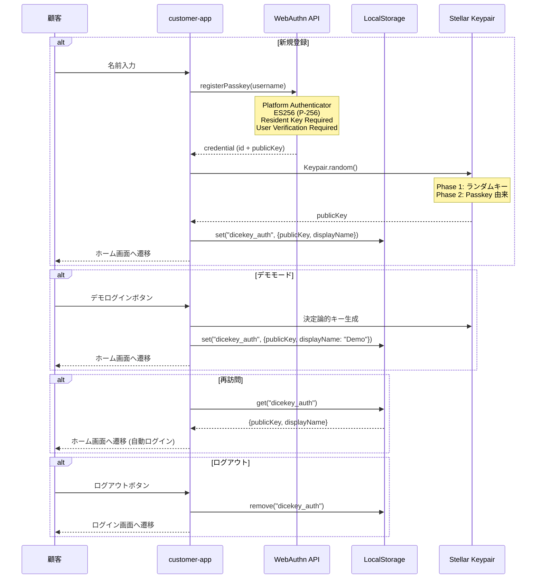
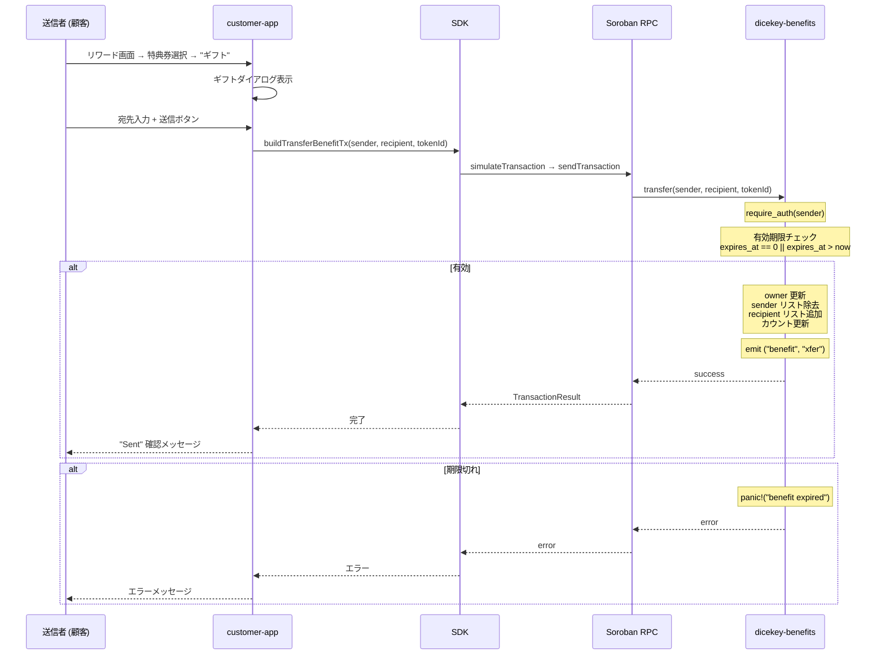
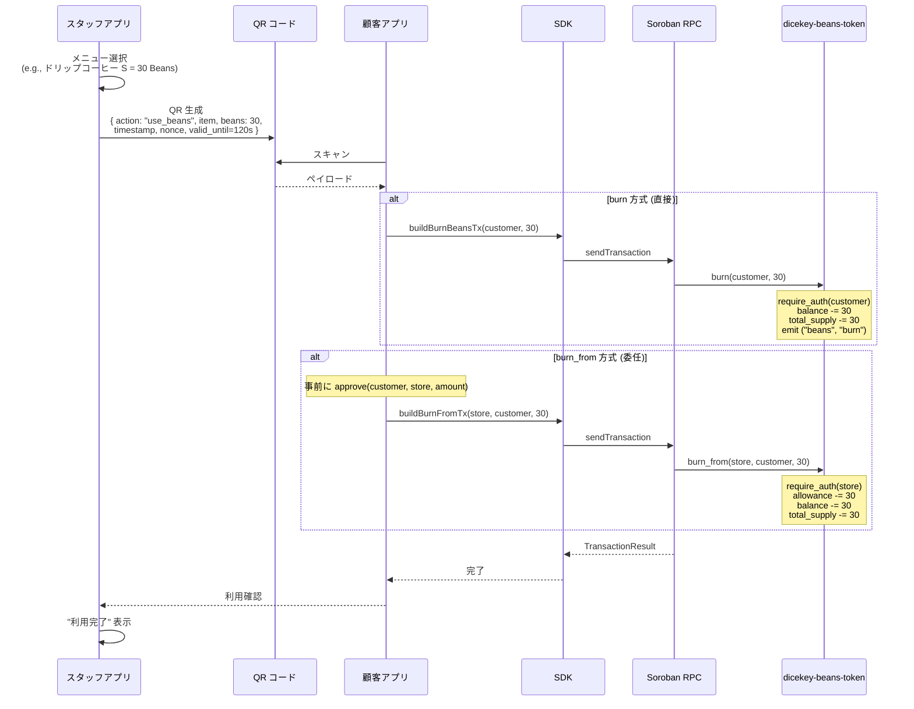
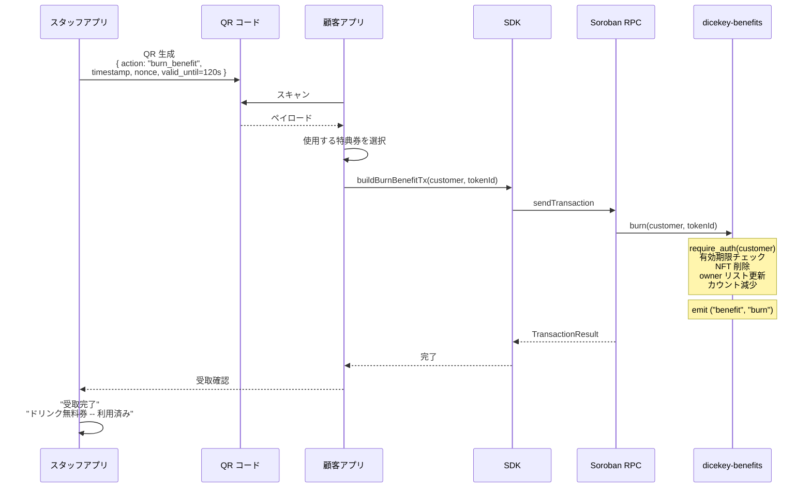
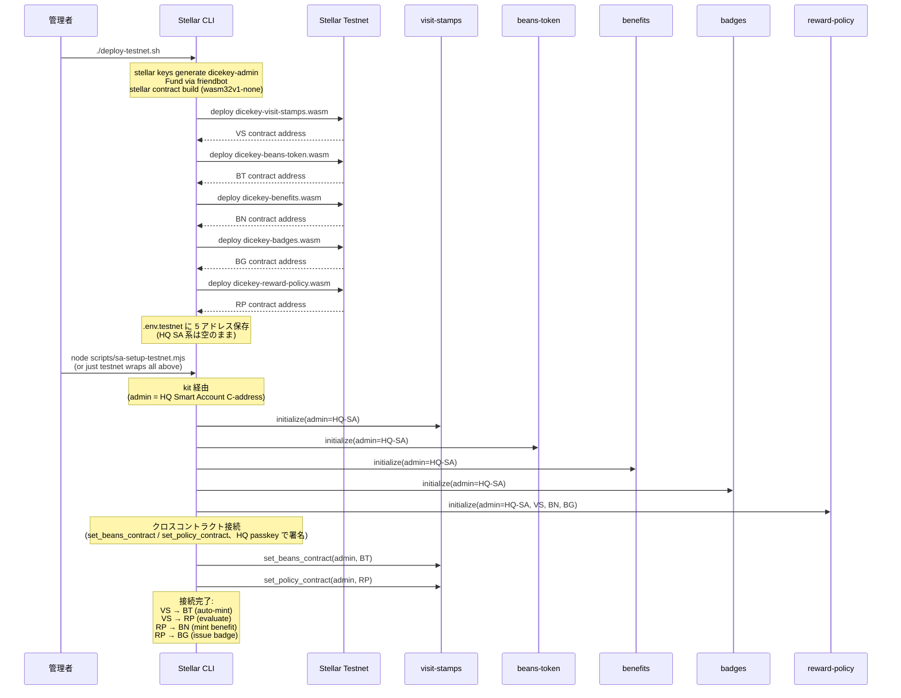
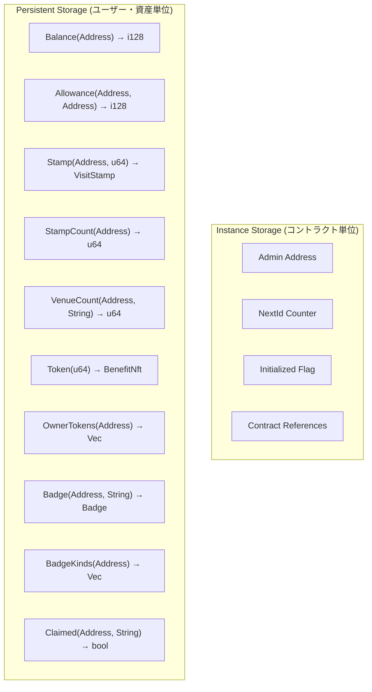
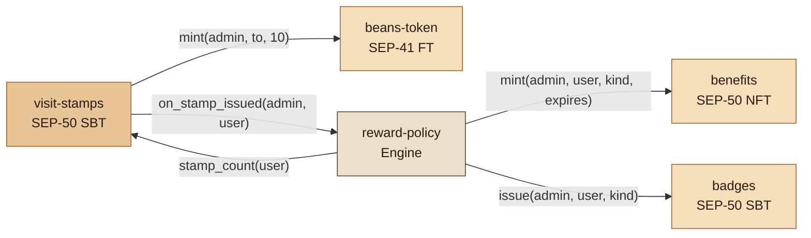
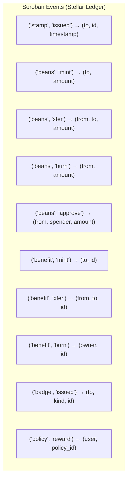

# dicekey Coffee Stamps データフロー図（逆生成）

## 分析概要

| 項目 | 値 |
|---|---|
| **分析日時** | 2026-05-19 |
| **フロー数** | 6 メインフロー |

---

## 1. スタンプ発行フロー（メインフロー）

システムの中核フロー。スタンプ発行が Beans 自動ミントとポリシー評価をカスケード的にトリガーする。



---

## 2. 顧客認証フロー



---

## 3. 特典券ギフトフロー



---

## 4. Beans 利用フロー（店舗）



---

## 5. 特典券受取フロー（店舗）



---

## 6. コントラクトデプロイ・初期化フロー



---

## 状態管理フロー

### フロントエンド状態管理

```mermaid
flowchart TD
    subgraph AuthContext [AuthContext (顧客)]
        A1[isLoggedIn: boolean]
        A2[publicKey: string | null]
        A3[displayName: string | null]
    end

    subgraph StaffAuthContext [StaffAuthContext (スタッフ)]
        S1[isLoggedIn: boolean]
        S2[venue: string | null]
        S3[venueName: string | null]
    end

    subgraph LocalStorage
        LS1["dicekey_auth → {publicKey, displayName}"]
        LS2["dicekey_staff_auth → {venue, venueName}"]
    end

    AuthContext <-->|hydrate / persist| LS1
    StaffAuthContext <-->|hydrate / persist| LS2

    subgraph Pages [ページ状態 (useState)]
        P1["IssueStampPage: state = idle|showing|done"]
        P2["RewardsPage: giftTarget, showDialog"]
        P3["UseBeansPage: selectedItem, qrState"]
    end
```

### オンチェーン状態管理



---

## クロスコントラクト呼び出しグラフ



---

## イベント発行マップ


